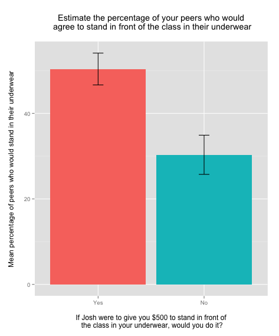

USF-RUG Demo for First Meeting
===

This repository contains the data and source to run the demonstration from the first USF R Users Group meeting. The demo imports data from an SPSS file, reads it in a few different ways, performs an ANOVA, and displays the results.

Running the Code
---

To run this code, open the `Welcome [093013].Rproj` file in RStudio and `source("demo.R")`.

